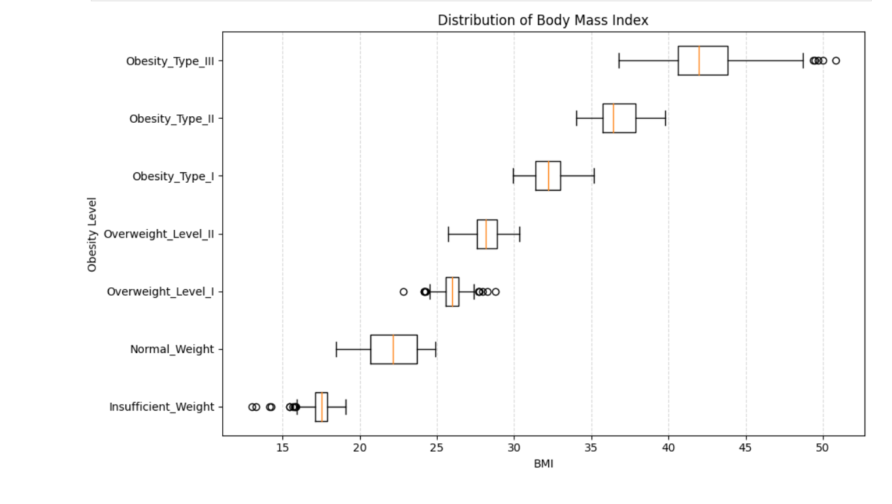
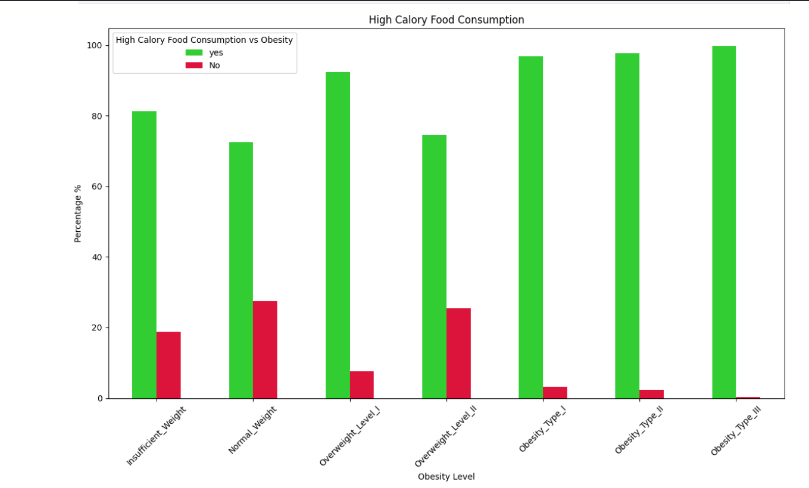
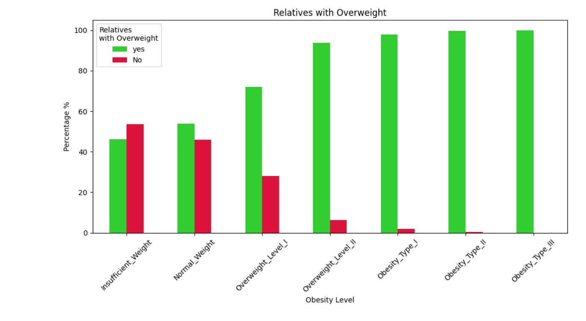
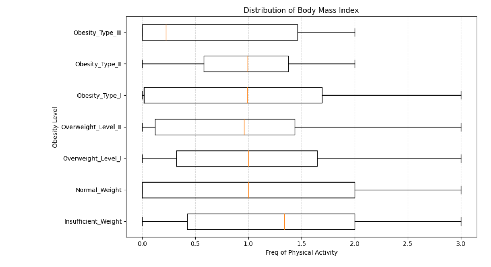
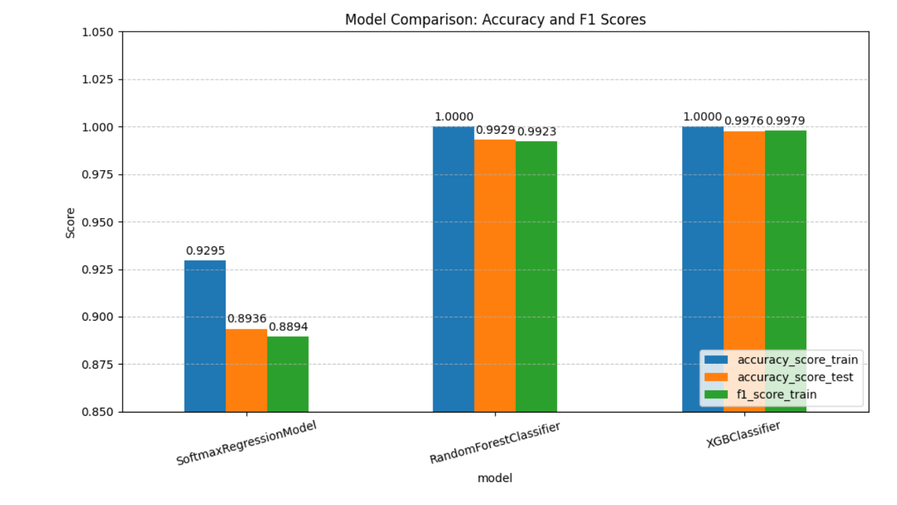

# Predict Obesity Level Using Supervised/Unsupervised Machine Learning

---

## Exploratory Data Analysis

  
   
  <em>BMI vs Obesity Level</em>

  
   
  <em>High Calorie Food Consumption vs Obesity Level</em>

  
   
  <em>Relatives with Overweight vs Obesity Level</em>

  
   
  <em>Frequency of Physical Activity vs Obesity Level</em>

---

## Models

  
   
  <em>Performance of Models</em>

